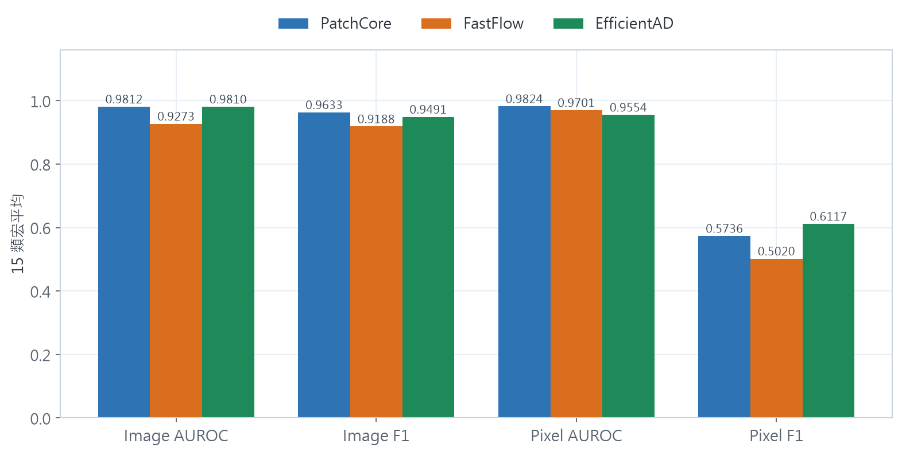

# MVTec AD 工業影像異常偵測

本專案使用 MVTec AD，比較 PatchCore、FastFlow 與 EfficientAD 在 15 個
物件與紋理類別上的異常偵測與瑕疵定位表現，共完成 45 組基準實驗，並進行
Labelme 標註品質、資料擴增、解析度與失敗案例分析。

## 主要結果

PatchCore 的 Image AUROC 為 0.9812、Image F1 為 0.9633；EfficientAD 的
Pixel F1 為 0.6117，在三個模型中最高。




## 主要技術

- Python、PyTorch、Anomalib
- PatchCore、FastFlow、EfficientAD
- pandas、NumPy、scikit-learn、matplotlib
- Labelme：瑕疵區域標註
- Pillow：影像處理與資料擴增

## 專案結構

```text
.
├── src/          模型執行與分析程式
├── results/      已完成實驗的精簡結果
├── figures/      實驗結果圖表
├── data/         資料集放置說明
└── requirements.txt
```

主要結果檔案：

- `all_runs_compact.csv`：三個模型 × 15 類別
- `augmentation_comparison.csv`：資料擴增比較
- `labelme_quality.csv`：人工標註品質
- `resolution_experiments.csv`：256／384 解析度比較

## 安裝

建議使用 Python 3.11：

```bash
git clone https://github.com/baodian716/mvtec-ad-anomaly-detection.git
cd mvtec-ad-anomaly-detection
python -m venv .venv
```

啟用環境：Windows 執行 `.venv\Scripts\Activate.ps1`；macOS／Linux 執行
`source .venv/bin/activate`。接著依照
[PyTorch 官方說明](https://pytorch.org/get-started/locally/)安裝適合硬體的版本，
再執行：

```bash
python -m pip install -r requirements.txt
```

## 資料下載

完整 15 類資料使用 Hugging Face 第三方鏡像：
[ProgrammerGnome/MVTecAD](https://huggingface.co/datasets/ProgrammerGnome/MVTecAD)。

```bash
hf download ProgrammerGnome/MVTecAD mvtec_anomaly_detection.tar.xz \
  --repo-type dataset \
  --local-dir data/download
```

解壓縮後，將直接包含 15 個類別的資料夾放在 `data/mvtec_ad/`，或在執行時
使用 `--dataset-root` 指定位置。詳細結構請見 [data/README.md](data/README.md)。

EfficientAD 另外需要
[ImageNette](https://github.com/fastai/imagenette)，預設位置為
`data/imagenette2/train/`。資料鏡像的內容與授權仍以 MVTec 原始
`license.txt` 為準。

## 執行

執行單一 PatchCore 類別：

```bash
python src/run_anomaly_model.py --model patchcore --category metal_nut
```

指定自訂資料路徑：

```bash
python src/run_anomaly_model.py \
  --model fastflow \
  --category bottle \
  --dataset-root /path/to/mvtec_ad
```

批次執行指定模型與類別：

```bash
python src/batch_benchmark.py \
  --models patchcore fastflow efficientad \
  --categories bottle metal_nut
```

已完成的 45 組結果可直接從 `results/` 查看，不需要重新訓練。
