# MVTec AD 非監督式異常偵測：PatchCore／FastFlow／EfficientAD 比較與失敗分析

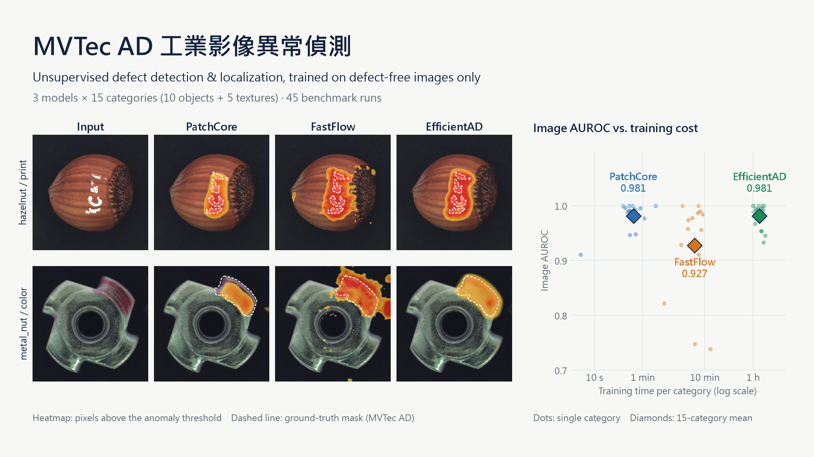

> 使用公開資料集 MVTec AD 的練習專案。在「只有良品影像可以訓練」的前提下，
> 以統一協定比較三種非監督式異常偵測方法的效果、成本與失敗型態，
> 並用產線常用的漏檢率／過殺率檢視結果。**本專案不是產線實測**，限制列於文末。

## 摘要

| | |
|---|---|
| **問題** | 產線初期通常只有良品、沒有瑕疵標籤，因此改用只學「正常長什麼樣」的非監督式異常偵測 |
| **做了什麼** | 3 模型 × 15 類 = 45 組基準實驗；失敗分析；資料擴增、解析度、標註品質三組單變因實驗；ONNX 互動 demo |
| **結果** | PatchCore 與 EfficientAD 的 Image AUROC 相當（0.9812／0.9810，差距在抽樣誤差內），但 15 類訓練時間約 **11 分鐘 vs 19 小時** |
| **選型** | 以 PatchCore 為預設；需要較精確的瑕疵範圍時考慮 EfficientAD（Pixel F1 最高） |
| **產線視角** | 預設門檻下 PatchCore 漏檢率 5.4%；要做到零漏檢，約 21% 的良品會被判 NG，需要搭配人工複判 |

## 專案流程

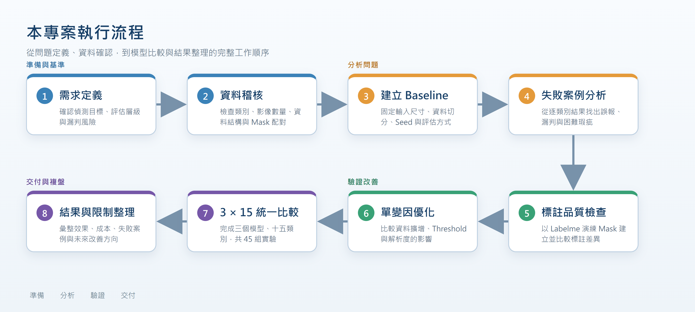

## 主要結果

15 類平均，評估影像為各類別 test 中**未參與門檻決定**的一半（瑕疵 633 張、良品 236 張）：

| 模型 | Image AUROC | Image F1 | Pixel AUROC | Pixel F1 | 誤報 FP | 漏判 FN |
|---|---:|---:|---:|---:|---:|---:|
| **PatchCore** | **0.9812** | **0.9633** | **0.9824** | 0.5736 | **11** | **34** |
| FastFlow | 0.9273 | 0.9188 | 0.9701 | 0.5020 | 54 | 54 |
| EfficientAD | 0.9810 | 0.9491 | 0.9554 | **0.6117** | 20 | 47 |

- **PatchCore 與 EfficientAD 在影像層級打平**：以 bootstrap（重抽 2,000 次）估計，兩者 Image AUROC 差距的 95% 信賴區間為 **−0.0145 ～ +0.0129**，0.0002 的差距不代表誰比較好。
- **平均會掩蓋個別類別**：例如 PatchCore 最差的是 toothbrush（0.911），FastFlow 在 hazelnut、screw 明顯落後。

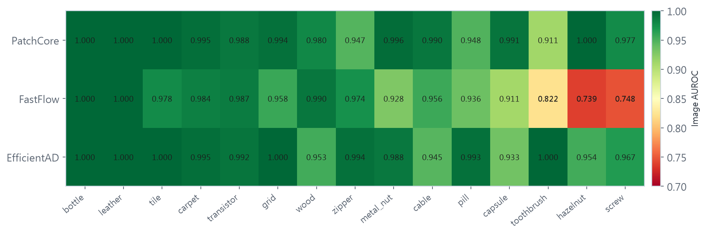

完整數據：[`results/all_runs_compact.csv`](results/all_runs_compact.csv)

## 效果與成本

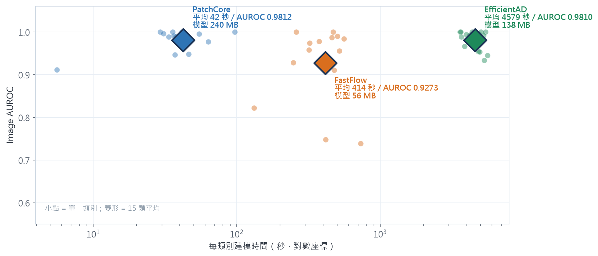

| 模型 | 每類建模時間 | 15 類合計 | 推論延遲* | 模型大小 |
|---|---:|---:|---:|---:|
| PatchCore | 42 秒 | 約 11 分鐘 | 11.50 ms | 240 MB |
| FastFlow | 414 秒 | 約 1.7 小時 | 13.12 ms | 56 MB |
| EfficientAD | 4,579 秒 | 約 19.1 小時 | 7.06 ms | 138 MB |

環境：RTX 5070 Ti、Windows 11、PyTorch 2.7.1、Anomalib 2.4.2。
\* 只量 GPU 上的模型前向運算，**不等於產線節拍**（未含取像、傳輸、前後處理與設備通訊）。

換產品就需要重建模型，因此訓練時間是實際成本：PatchCore 幾分鐘即可重建，EfficientAD 需要將近一天。

## 以產線指標檢視：漏檢率與過殺率

論文以 AUROC、AUPRO 等不需門檻的指標比較方法；產線則需要選定門檻，看**漏檢率（Escape rate，瑕疵被判為良品）**與**過殺率（Overkill rate，良品被判為瑕疵）**。

| 模型 | 預設門檻：漏檢率 | 預設門檻：過殺率 | 零漏檢時的過殺率 |
|---|---:|---:|---:|
| PatchCore | **5.4%**（34/633） | **4.7%**（11/236） | **20.8%** |
| FastFlow | 8.5%（54/633） | 22.9%（54/236） | 45.3% |
| EfficientAD | 7.4%（47/633） | 8.5%（20/236） | 28.0% |

- **預設門檻**是在 validation 上讓 F1 最大的位置，等於把漏檢和過殺看得一樣重要，是學術評估的設定，不是產線的操作點。
- **零漏檢**：每個類別把門檻降到「所有瑕疵都判 NG」為止。PatchCore 仍約有 21% 的良品會被判 NG，代表單靠調整門檻無法同時壓低漏檢與過殺，**需要人工複判**來處理門檻附近的影像。
- 良品只有 236 張（每類約 16 張），比例的誤差很大，僅供比較三個模型的相對表現。

計算程式：[`src/analyze_operating_points.py`](src/analyze_operating_points.py)，逐類別結果：[`results/operating_points.csv`](results/operating_points.csv)

## 瑕疵定位：熱圖比較

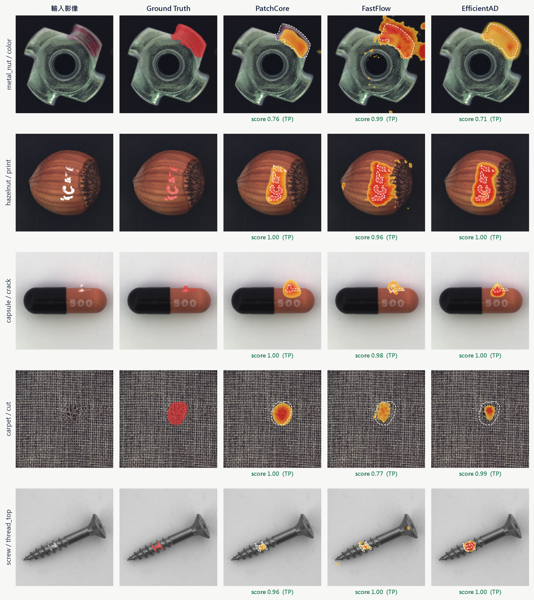

**圖：MVTec AD 測試影像的瑕疵定位比較。** 由左至右為輸入影像、Ground Truth（官方標註）與三模型的 anomaly map。熱區只標出超過像素門檻的區域，白色虛線為 Ground Truth 輪廓，下方為影像異常分數（門檻 0.5）。樣本選自三模型皆判對的影像，用來比較定位差異，非隨機抽樣。

- **PatchCore**：熱區緊貼瑕疵，很少外溢，對應誤報最少
- **FastFlow**：熱區常溢出到良品區域，對應誤報最多
- **EfficientAD**：圈出的形狀最完整，對應 Pixel F1 最高

## 失敗分析

**1. 漏判大多落在門檻附近**

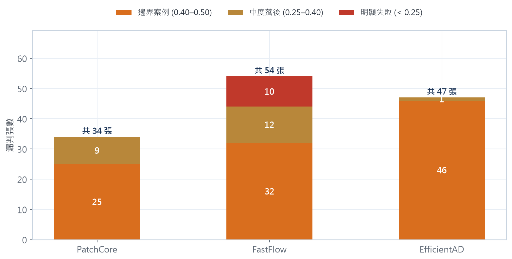

EfficientAD 的 47 張漏判中有 46 張分數在 0.40～0.50；FastFlow 有 10 張明顯失敗（分數 < 0.25）。門檻附近的影像適合交給人工複判。

**2. 三個模型錯的地方不同**

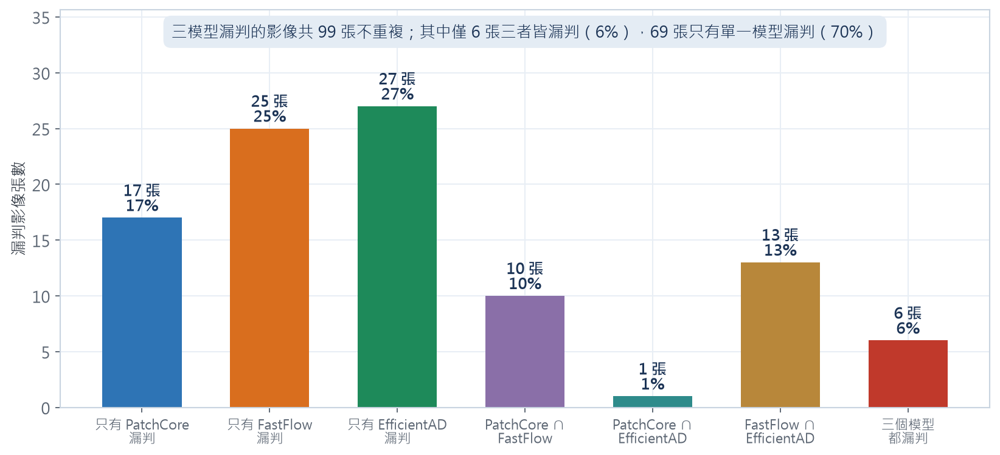

三模型的漏判合計 99 張不重複影像，只有 6 張是三者同時漏判，約 70% 只被一個模型漏判。

**3. 三模型都漏判的案例：pill／crack**

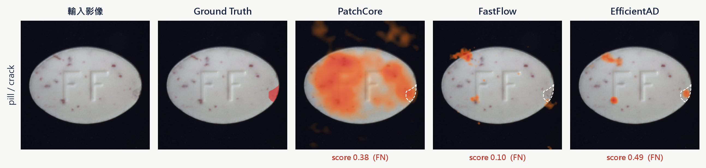

**圖：三模型皆漏判的 pill/crack/024。** 三者分數皆未達門檻，此圖改以單張影像內的相對強度上色，顯示模型「最懷疑」的區域。PatchCore 被藥錠上正常的紅色斑點干擾；EfficientAD 其實在裂痕處有反應，但分數 0.49 差一點未達門檻。

**4. 漏判張數相同，難度卻不同：metal_nut 的 bent 與 color**

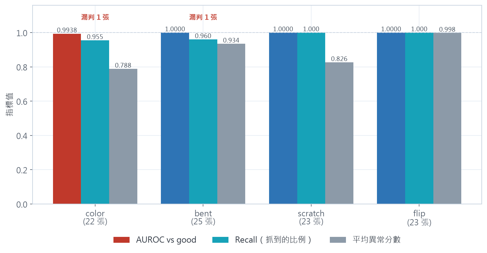

兩者各漏判 1 張，但 bent 漏判的那張分數高於所有良品（調低門檻即可救回），color 漏判的那張則有 3 張良品分數比它高（調門檻救不回來，是特徵本身分不開）。因此後續單變因實驗以 color 為對象。

## 單變因實驗

| 實驗 | 結果 | 決定 |
|---|---|---|
| 旋轉擴增 | color AUROC 0.9938 → 0.9979，但漏判仍為 1 張、Pixel F1 略降、建庫時間 3.6 倍 | 不採用 |
| 照明擴增 | 沒有改善，建庫時間 3.6 倍 | 不採用 |
| 解析度 256 → 384 | metal_nut（3 seeds）誤報平均 1.00 → 0 張、漏判不變；carpet 的 Image F1 0.9888 → 0.9438；成本約 4 倍 | 維持 256，不宣稱通用（其餘 13 類未驗證） |
| FastFlow 拆解（hazelnut） | epoch 50 → 500：AUROC 0.7386 → 0.6029；backbone 改 wide_resnet50_2：→ 0.8557，時間 1.2 倍 | 單一類別上，backbone 容量比訓練量影響大 |
| EfficientAD 步數（capsule） | 20k：0.7848、30k：0.8409、70k（論文設定）：0.9333；每個步數皆從頭訓練 | 維持 70k |
| Labelme 人工標註（metal_nut/color 5 張） | 與官方 mask 比較：Dice 0.850、Precision 0.935、Recall 0.799 | 標註位置正確但範圍偏窄；正式標註前應先訂邊界規則 |

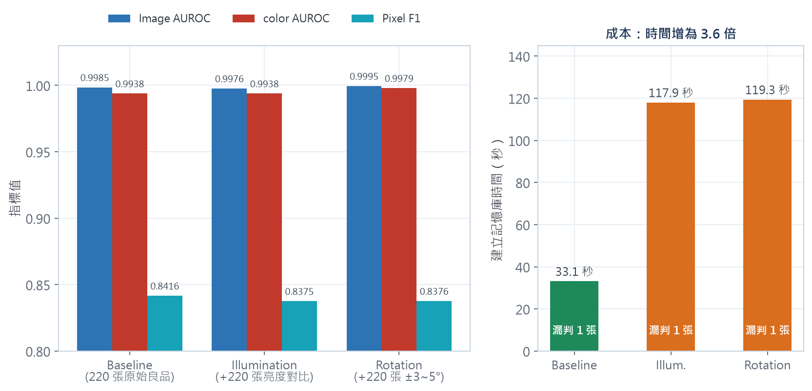

## 評估協定與可信度

**切分 validation 與 test**：Anomalib 預設讓 validation 與 test 使用同一批影像，門檻會看到測試標籤。本專案把官方 test 依標籤分層切成兩半，一半決定門檻、一半評分。若改為直接在 test 上挑 F1 最大的門檻，F1 平均會高估 0.017～0.031，每類多藏起 1.4～2.6 個錯誤（見 `src/analyze_operating_points.py`）。

**與原論文對照**：從 checkpoint 重新推論、改用完整官方 test 評估（不重新訓練），兩種協定的 Image AUROC 只差 0.0006～0.0038。

| 模型 | 本專案（完整 test）I-AUROC／P-AUROC／AUPRO | 原論文 |
|---|---|---|
| PatchCore-10%（wide_resnet50_2） | 0.9825／0.9801／0.9295 | 0.990／0.981／0.935 |
| EfficientAD-S | 0.9772／0.9569／0.8993 | I-AUROC 0.988 |
| FastFlow（ResNet18） | 0.9279／0.9686／0.8841 | 0.979／0.972 |

PatchCore 與論文差距在 1 個百分點內，確認資料處理與評估流程正確；FastFlow 差距 5.1 個百分點，對應上方的 backbone 拆解實驗。

**ONNX 一致性**：demo 使用的 ONNX 模型（metal_nut、screw、pill 3 類 × 3 模型），在 669 次推論中與實驗分數逐張比對，各模型平均差異 0.00002～0.0012；只有 1 張（pill/scratch/022，實驗 0.4993、ONNX 0.5004）因剛好落在門檻邊界而判定不同（見 `results/onnx_parity.csv`）。

## 互動 Demo

React 前端 + FastAPI 後端，模型以 ONNX Runtime 在 CPU 上推論（不需要 PyTorch）。

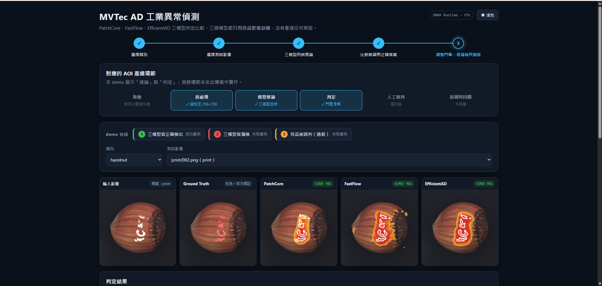

- 選擇類別（metal_nut、screw、pill）與測試影像，三模型並排顯示熱圖、分數、判定與推論時間
- **demo 按鈕**：一鍵切換到「三模型皆正確檢出」「三模型皆漏檢」「過殺」三個代表案例
- **門檻滑桿**：即時顯示各模型的漏檢率、過殺率與取捨曲線
- 標示本 demo 對應的 AOI 環節：涵蓋「前處理、模型推論、判定」；取像、人工複判、追溯未涵蓋

部署時發現 Anomalib 匯出 ONNX 的前處理（resize 未開 antialias）與訓練時不同，同一張影像的分數會偏移約 0.02（例如 metal_nut/bent/000 的 PatchCore 分數 0.983 → 0.964）。改為在 ONNX 外以訓練時相同的方式縮放後，669 次推論與實驗分數的平均差異降到 0.0012 以下（[`demo/backend/preprocess.py`](demo/backend/preprocess.py)、[`results/onnx_parity.csv`](results/onnx_parity.csv)）。

## 限制

- 使用公開資料集，影像條件一致，未涵蓋真實產線的光源、姿態與批次變化
- 門檻由含瑕疵樣本的 validation 決定；新產線初期通常沒有瑕疵樣本，需改以良品分數校準並在上線後修正
- 每類 test 良品約 16 張，漏檢率／過殺率的誤差大
- 主要實驗只跑一個 seed；FastFlow 拆解、EfficientAD 步數、解析度實驗只做了 1～2 個類別
- 延遲只量模型運算，未量端到端節拍；未實作人工複判流程與上線監控

## 專案結構

```text
.
├── src/                模型訓練、推論匯出、分析與圖表程式
├── demo/
│   ├── backend/        FastAPI + ONNX Runtime、ONNX 匯出與一致性驗證
│   └── frontend/       React（Vite + TypeScript）
├── results/            實驗結果（不需重新訓練即可查看）
├── figures/            圖表
├── data/               資料集放置說明
└── start_demo.bat      Windows 一鍵啟動 demo
```

| 結果檔 | 內容 |
|---|---|
| `all_runs_compact.csv` | 三模型 × 15 類指標與成本 |
| `per_image_predictions.csv` | 45 組實驗的逐圖分數（demo 門檻滑桿的資料來源） |
| `operating_points.csv` | 逐類別漏檢／過殺、零漏檢門檻與門檻洩漏分析 |
| `onnx_parity.csv` | ONNX 與實驗分數的逐張比對 |
| `augmentation_comparison.csv`、`resolution_experiments.csv`、`labelme_quality.csv` | 單變因實驗 |

## 安裝

建議使用 Python 3.11：

```bash
git clone https://github.com/baodian716/mvtec-ad-anomaly-detection.git
cd mvtec-ad-anomaly-detection
python -m venv .venv
```

啟用環境（Windows：`.venv\Scripts\Activate.ps1`；macOS／Linux：`source .venv/bin/activate`），
依 [PyTorch 官方說明](https://pytorch.org/get-started/locally/) 安裝適合硬體的版本後：

```bash
python -m pip install -r requirements.txt
```

## 資料

Anomalib 內建的下載網址已失效，改用 Hugging Face 鏡像
[ProgrammerGnome/MVTecAD](https://huggingface.co/datasets/ProgrammerGnome/MVTecAD)：

```bash
hf download ProgrammerGnome/MVTecAD mvtec_anomaly_detection.tar.xz --repo-type dataset --local-dir data/download
```

解壓縮後放在 `data/mvtec_ad/`，結構見 [data/README.md](data/README.md)。EfficientAD 另需
[ImageNette](https://github.com/fastai/imagenette)（`data/imagenette2/train/`）。
Anomalib 不接受含中文的資料集路徑。MVTec AD 授權為 **CC BY-NC-SA 4.0（僅限非商業使用）**。

## 執行

```bash
# 訓練與評估
python src/run_anomaly_model.py --model patchcore --category metal_nut
python src/batch_benchmark.py --models patchcore fastflow efficientad --categories bottle metal_nut

# 補充分析（只讀 results/，不需要資料集）
python src/analyze_operating_points.py
```

**Demo（直接使用已發布的模型）**：ONNX 模型與 demo 影像已發布在
[Hugging Face：Haolian07/mvtec-ad-demo-assets](https://huggingface.co/Haolian07/mvtec-ad-demo-assets)，
不需要資料集與訓練即可啟動（只需 `demo/backend/requirements.txt` 與 Node.js）：

```bash
pip install -r demo/backend/requirements.txt huggingface_hub
cd demo/frontend && npm install && npm run build && cd ../..    # 建置前端
```

```powershell
$env:ASSETS_REPO = "Haolian07/mvtec-ad-demo-assets"   # 第一次用到某類別時自動下載該類別的模型
python demo/backend/server.py                           # 開啟 http://localhost:7860
```

**Demo（從自己訓練的模型匯出）**：需要 `weights/<模型>/<類別>/model.ckpt` 與 `data/mvtec_ad/`，
先執行 `python demo/backend/export_onnx.py` 匯出並驗證 ONNX，再以 `python demo/backend/server.py` 啟動；
Windows 也可以直接雙擊 `start_demo.bat`。
